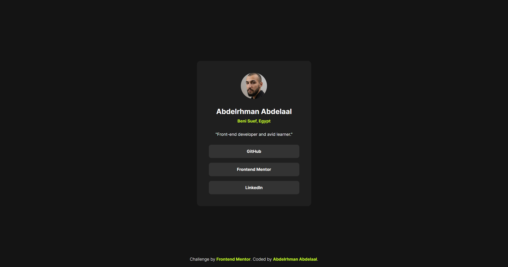

# Frontend Mentor - Social links profile solution

This is a solution to the [Social links profile challenge on Frontend Mentor](https://www.frontendmentor.io/challenges/social-links-profile-UG32l9m6dQ). Frontend Mentor challenges help you improve your coding skills by building realistic projects.

## Table of contents

- [Overview](#overview)
  - [Screenshot](#screenshot)
  - [Links](#links)
- [My process](#my-process)
  - [Built with](#built-with)
  - [What I learned](#what-i-learned)
  - [Continued development](#continued-development)
  - [Useful resources](#useful-resources)
- [Author](#author)
- [Acknowledgments](#acknowledgments)

## Overview

### Screenshot

### Links

- Solution URL: [GitHub](https://github.com/MrBlackvanta/social-links-profile)
- Live Site URL: [Netlify](https://vanta-social-links-profile.netlify.app)

## My process

### Built with

- React + Vite
- TypeScript
- Tailwind CSS v4 (`@theme` tokens, `@utility` for typography and social-link styles)
- Component-based layout (`ProfileCard` in `src/components`)
- Mobile-first, centered card on a full-viewport background (`h-dvh`, `max-w-96`)
- Inter variable font loaded locally (`src/assets/fonts`)
- Avatar and social assets under `src/assets` (e.g. `avatar-abdelrhman.webp`)

### What I learned

- Turning a profile mockup into a small React tree: semantic regions (`article`, `figure`, list of links) without over-abstracting.
- Using Tailwind v4’s theme layer for brand colors and reusable `@utility` classes (`text-preset-*`, `social-link`) so JSX stays readable.
- Building accessible social links: visible labels live inside each `<a>` so the link name matches what sighted users read and screen readers announce it correctly.
- Pairing Vite path aliases with TypeScript for clean imports (`components`, `assets`).
- Keeping the profile card as a focused, mostly static component while `App` owns page chrome (background, footer attribution).

## Author

- UpWork - [Abdelrhman Abdelaal](https://upwork.com/freelancers/~01f0a9479696b61f49)
- Frontend Mentor - [@MrBlackvanta](https://www.frontendmentor.io/profile/MrBlackvanta)
- LinkedIn - [@yourusername](https://www.linkedin.com/in/abdelrhman-vanta/)
