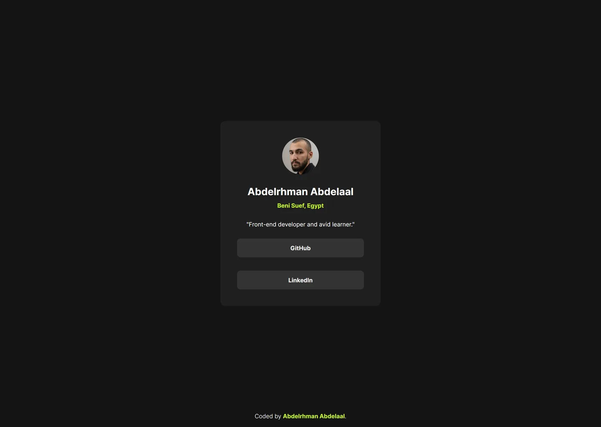

# Social links profile

My solution to the [Social links profile](https://www.frontendmentor.io/challenges/social-links-profile-UG32l9m6dQ)
challenge on Frontend Mentor.

- Live: https://social-links-profile.abdelrhman-ahmed8881.workers.dev
- Code: https://github.com/MrBlackvanta/social-links-profile

## Built with

- React
- Vite
- TypeScript
- Tailwind CSS
- Inter, self-hosted

## Author

- [LinkedIn](https://www.linkedin.com/in/abdelrhman-vanta/)
- [UpWork](https://www.upwork.com/freelancers/mrblackvanta)
- [Frontend Mentor](https://www.frontendmentor.io/profile/MrBlackvanta)
